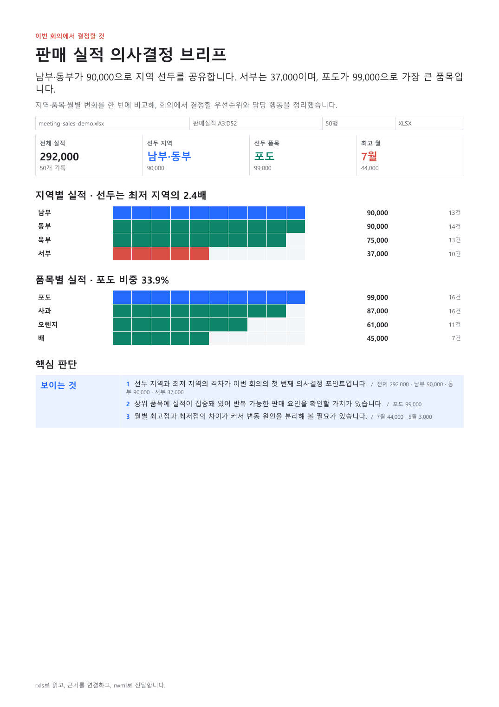
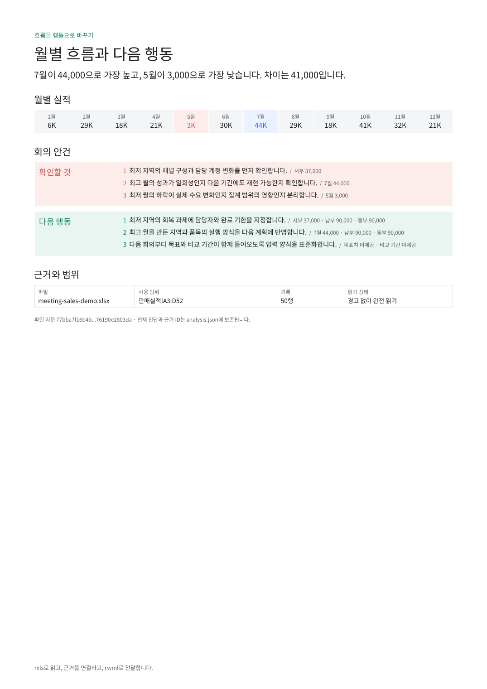

# SheetBrief

[](https://github.com/HyunjoJung/sheetbrief/actions/workflows/ci.yml)
[](https://github.com/HyunjoJung/sheetbrief/actions/workflows/security.yml)

**SheetBrief, 엑셀 속 데이터를 의사결정 가능한 보고서로 바꾸다.**

업무에서는 같은 실적표도 `.xls`, `.xlsx`, `.xlsb`, `.ods`처럼 서로 다른
형식과 서식으로 전달됩니다. SheetBrief는 파일을 읽고 끝나는 요약기가 아니라,
근거 셀을 추적할 수 있는 사실 계약을 만든 뒤 회의에서 바로 사용할 DOCX와 PDF를
생성하는 단일 기능 에이전트입니다.

```text
워크북 바이트
  -> rxls 구조 판독
  -> 근거 ID가 붙은 사실 계약
  -> Solar 의사결정 서술
  -> 서술 검증
  -> rwml 2쪽 DOCX/PDF
```

[English](README.en.md) | [MABC 제출 패키지](submission/MABC-2026.md) |
[MCP 계약](docs/MCP-CONTRACT.md) | [배포](docs/DEPLOYMENT.md) |
[검증 기록](docs/VERIFICATION.md)

## 결과 미리보기

[PDF 전체 보기](docs/samples/sheetbrief-demo.pdf) |
[편집 가능한 DOCX](docs/samples/sheetbrief-demo.docx)

| 1쪽: 결론과 비교 | 2쪽: 흐름과 행동 |
| --- | --- |
|  |  |

## 무엇이 다른가

- **파일 형식부터 처리합니다.** 네이티브 Rust 라이브러리 `rxls`로
  `.xls/.xlsx/.xlsb/.ods`를 같은 분석 경로에 올립니다.
- **숫자는 모델이 쓰지 않습니다.** 합계와 집계값은 코드가 계산하고, Solar는
  반환된 `fact_id`와 `context_id`만 인용해 판단·질문·행동을 작성합니다.
- **보고서가 결과물입니다.** `rwml`로 편집 가능한 DOCX와 동일 모델 기반 PDF를
  만들며, 생성한 DOCX를 다시 열어 유효성을 확인합니다.
- **회의 흐름에 맞춥니다.** 첫 페이지는 결론과 비교, 둘째 페이지는 월별 흐름과
  확인할 것·다음 행동으로 고정합니다.

현재 예선 기능은 `지역/품목/수량/월` 또는 대응하는 영문 헤더를 가진 판매 실적표
한 장을 대상으로 합니다. 목표치·비교 기간·가격이 없으면 이를 추측하지 않고
컨텍스트 상태로 분리합니다.

## 바로 실행하기

Rust 1.92 이상에서 공개 데모 워크북으로 전체 경로를 실행합니다. PDF 렌더링을
사용하지 않는 `rxls`/`rwml` 기본 경로보다 MSRV가 높은 이유는 `rwml`의 선택적
렌더러 의존성입니다.

```powershell
cargo run -- run .\data\meeting-sales-demo.xlsx .\artifacts\mabc-demo
```

다음 파일이 생성됩니다.

- `analysis.json`: 파서 상태, 선택 범위, 집계값, 근거 ID
- `report.docx`: 편집 가능한 2쪽 회의 브리프
- `report.pdf`: `rwml`이 같은 문서 모델에서 렌더링한 미리보기

원본 공개 데이터와 한국어 데모의 출처·재생성 방법은
[data/README.md](data/README.md)에 기록돼 있습니다.

## MCP 실행

```powershell
$env:SHEETBRIEF_API_TOKEN = "replace-with-at-least-32-random-characters"
cargo run -p sheetbrief-mcp
```

- Timely Agent / MCP Streamable HTTP: `http://127.0.0.1:8787/mcp`
- Legacy SSE compatibility: `http://127.0.0.1:8787/sse`
- Health: `http://127.0.0.1:8787/healthz`
- 도구: `analyze_workbook`, `build_report`

배포 시 `SHEETBRIEF_PUBLIC_BASE_URL`을 HTTPS 원점으로 지정하면 결과는 15분
만료 다운로드 링크로 반환됩니다. Timely Upload 노드의 `fileUrl`은 HTTPS
allowlist·공개 IP 확인·리다이렉트 차단·10 MiB 스트리밍 제한을 거쳐 읽습니다.

현재 Timely Agent에서는 우측 패널의 `스킬 + -> .skill/.zip 업로드`로 스킬을
추가하고, `커넥터 + -> JSON 등록 -> http`에서 `/mcp` 주소와 bearer token을
등록합니다. `/sse`는 구형 워크플로 SDK 호환 경로로 유지됩니다. 업로드용 스킬
원본은 [timely/sheetbrief/SKILL.md](timely/sheetbrief/SKILL.md)에 있습니다.
공개 Render 배포와 실제 Timely Agent 연결은 Solar Pro4로 검증했습니다. 공개
데모는 저장소의 고정 HTTPS 파일을 사용하고, 일반 사용자 파일은 Timely Upload
노드가 제공하는 `fileUrl`을 두 도구에 전달합니다. 직접 Agent 첨부가 노출하는
로컬 `file://` 경로는 원격 MCP 입력으로 사용하지 않습니다.

```powershell
.\scripts\package-timely-skill.ps1
```

이 명령은 `SKILL.md`가 ZIP 루트에 있는 `artifacts/sheetbrief-timely.zip`을
만들고 SHA-256을 출력합니다.

## 검증

```powershell
cargo fmt --all -- --check
cargo test --workspace
cargo clippy --workspace --all-targets -- -D warnings
```

레이아웃 기준과 검수 결과는 [docs/REPORT-DESIGN.md](docs/REPORT-DESIGN.md),
[docs/VERIFICATION.md](docs/VERIFICATION.md)에 있습니다.

## License

MIT. 공개 데모 워크북에는 별도의 BSD-2-Clause 고지가 적용됩니다.
